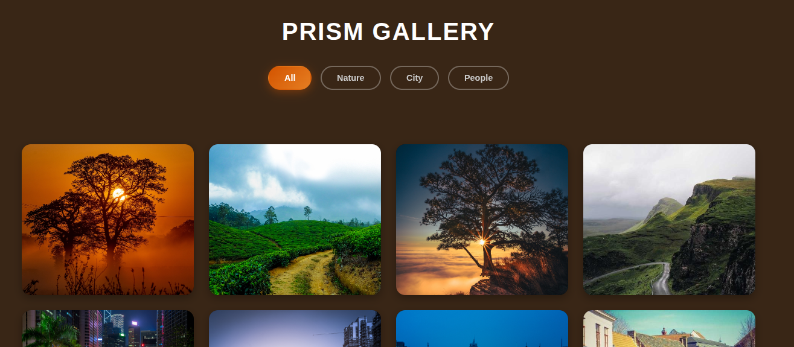

# 📸 Prism Gallery

**Alpha Code Internship - Task 1** A high-performance, responsive image gallery featuring category filtering, a lightbox view, and a custom "Deep Earth" dark theme.

🔗 **[Live Demo](https://code-alpha-prism-gallery.vercel.app/)**



## 📋 Project Overview

This project was built as part of my Frontend Development internship at **Alpha Code**. The goal was to build a functional, interactive image gallery using vanilla web technologies, focusing on performance optimization and responsive design.

The design features a custom "Dark Earth" theme (`#392616`) with "Burnt Orange" accents, offering a cinematic and immersive user experience.

## ✨ Key Features

* **🔍 Category Filtering:** Instantly filter images by category (All, Nature, City, People) using vanilla JavaScript.
* **💡 Interactive Lightbox:** Full-screen image viewer with "Next" and "Previous" navigation buttons that respect the currently active filter.
* **📱 Fully Responsive:** Built with CSS Grid (`auto-fill`) to look perfect on mobile, tablet, and desktop screens.
* **⚡ Performance Optimized:**
    * Optimized asset sizes for fast loading.
    * Used `will-change` and specific CSS transitions to ensure 60fps animations.
    * Eliminated layout thrashing by removing expensive blur effects.
* **🎨 Custom UI:** A unique dark-mode aesthetic with glassmorphism effects on hover.

## 🛠️ Technologies Used

* **HTML5:** Semantic structure.
* **CSS3:** Flexbox, Grid, Media Queries, and CSS Variables.
* **JavaScript (ES6):** DOM manipulation, Event Listeners, and Array methods.

## 🚀 How to Run Locally

1.  **Clone the repository**
    ```bash
    git clone [https://github.com/shatoo2022/prism-gallery.git]
    ```
2.  **Navigate to the project directory**
    ```bash
    cd prism-gallery
    ```
3.  **Open `index.html`** in your browser.

## 📂 Folder Structure

```text
/prism-gallery
│
├── index.html        # Main HTML structure
├── style.css         # Styling and Dark Theme logic
├── script.js         # Filtering and Lightbox logic
├── readme.md         # Project documentation
├── galleryimg.png    # Preview image
└── images/           # Optimized image assets
    ├── nature1.jpg
    ├── city1.jpg
    └── ...


    👤 Author
    AISHA MUHAMMAD IBRAHIM
    Frontend Intern Designed for Alpha Code Internship.

If you like this project, please give it a ⭐ on GitHub!
